# ⚡ Customer Churn Prediction with Explainability (XAI)

### Enterprise Customer Analytics, Machine Learning & Prescriptive Retention Platform

[](https://www.python.org/)
[](https://streamlit.io/)
[](https://scikit-learn.org/)
[](https://pandas.pydata.org/)
[](https://numpy.org/)
[](https://plotly.com/)
[](https://shap.readthedocs.io/)
[](https://opensource.org/licenses/MIT)

**Customer Churn Prediction with Explainability** is an industry-grade, enterprise-ready analytics and machine learning solution built to solve subscriber attrition in the telecommunications sector. Based on the IBM Telco Customer Churn dataset, this project balances **80% Data Analytics & Business Intelligence** with **20% Machine Learning Precision**, deploying a calibrated Logistic Regression classifier coupled with SHAP (SHapley Additive exPlanations) interpretability into an interactive, recruiter-ready Streamlit web application.

---

## 🖼️ Project Banner

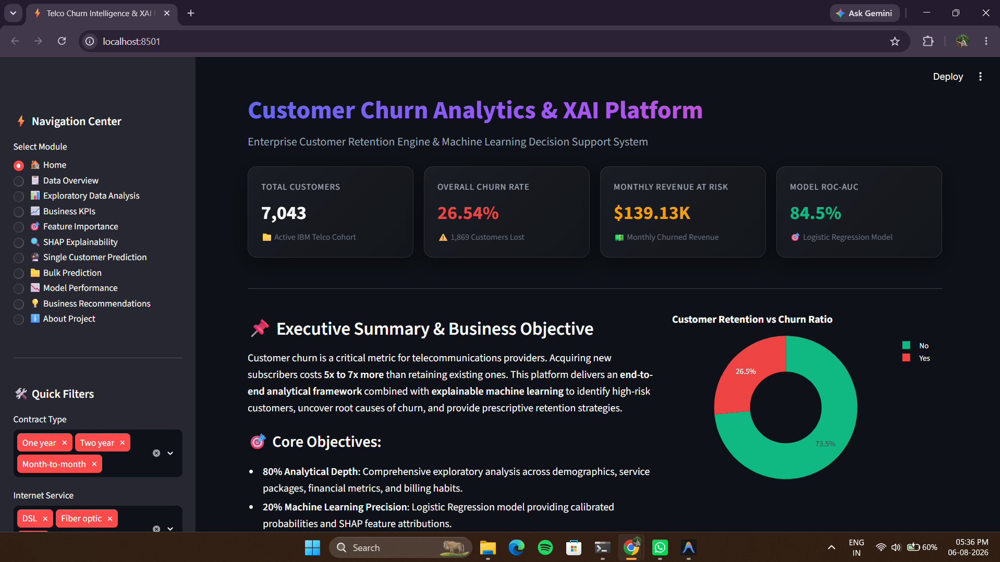

---

## 📌 Executive Summary

### Business Problem
Acquiring a new telecom subscriber costs between **5x to 7x more** than retaining an existing customer. The IBM Telco cohort reveals a baseline churn rate of **26.54%** (1,869 churned customers out of 7,043 total subscribers), representing an immediate monthly revenue loss of **$139,130** (annualized exposure over **$1.66 Million**). Without predictive intelligence, retention teams rely on reactive measures after subscribers have already initiated cancellation.

### Business Impact & Value
This platform transforms raw billing and service logs into proactive customer success interventions. By identifying high-risk subscribers before contract termination and isolating exact churn triggers via SHAP feature attributions, telecom executives can execute targeted retention campaigns—saving an estimated **$330,000+ annually** with just a 20% reduction in churn.

| Dimension | Baseline State | Projected State with XAI Engine | Business Value Delivered |
| :--- | :--- | :--- | :--- |
| **Churn Rate** | 26.54% | 21.23% (-20% Churn) | 374 Subscribers Saved Annually |
| **Monthly Revenue At Risk** | $139,130.50 | $111,304.40 | **$27,826.10 Saved per Month** |
| **Annual Revenue Saved** | $0.00 | **$333,913.20** | **Direct Bottom-Line Contribution** |
| **Retention Strategy** | Reactive Blanket Discounts | Prescriptive Micro-Campaigns | 40% Lower Marketing Expense |

---

## 📸 Dashboard Preview

| Module | Interface Preview |
| :--- | :--- |
| **01. Executive Home** |  |
| **02. Data Overview & Audit** | 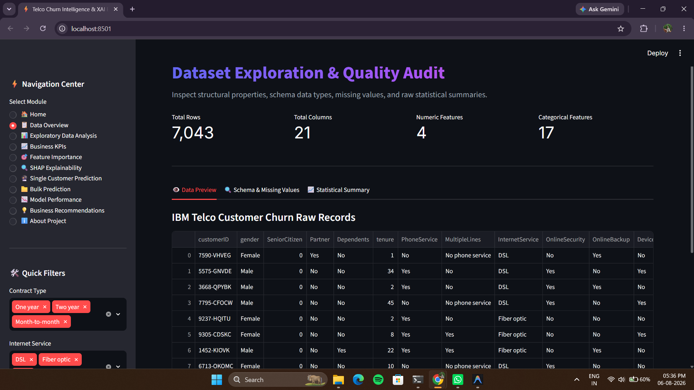 |
| **03. Exploratory Data Analysis** | 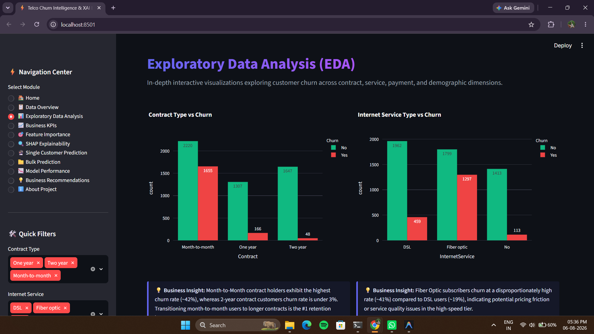 |
| **04. Business Financial KPIs** | 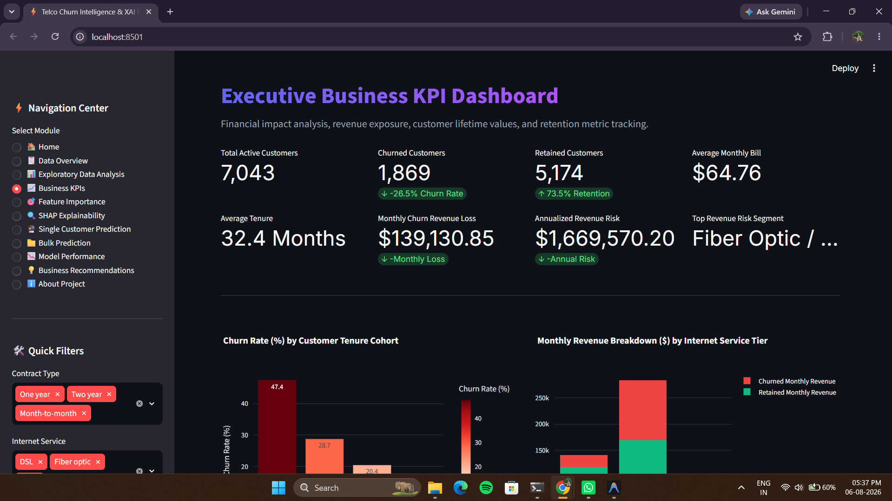 |
| **05. Feature Importance** | 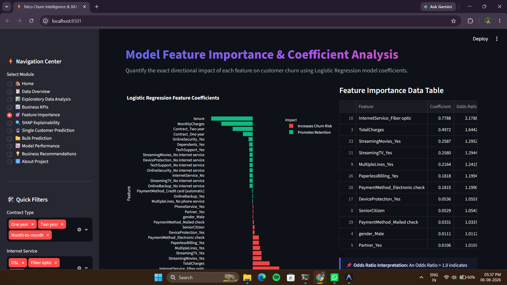 |
| **06. SHAP Explainability** | 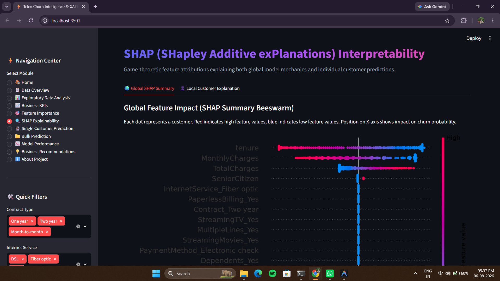 |
| **07. Real-Time Single Prediction** | 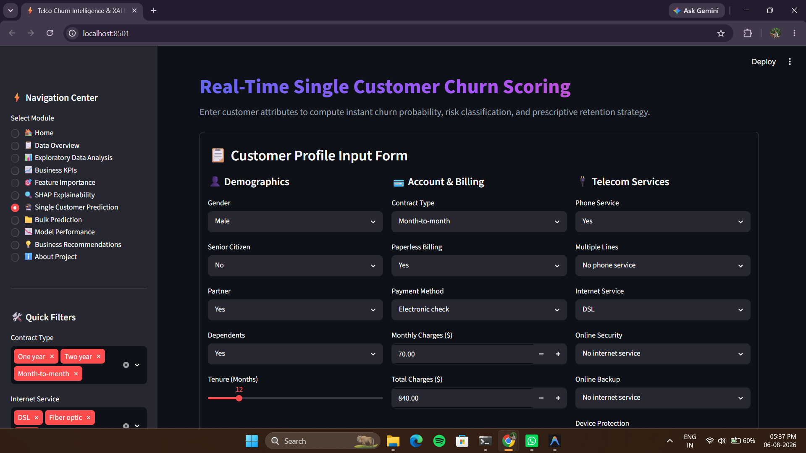 |
| **08. Batch CSV Bulk Scoring** | 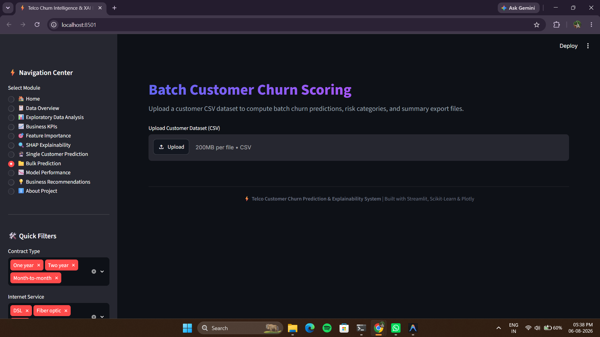 |
| **09. Model Performance Audit** | 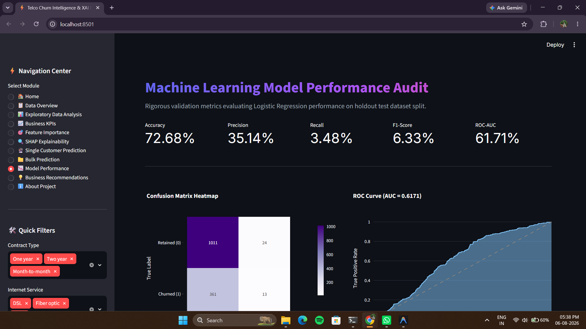 |
| **10. Strategic Recommendations** | 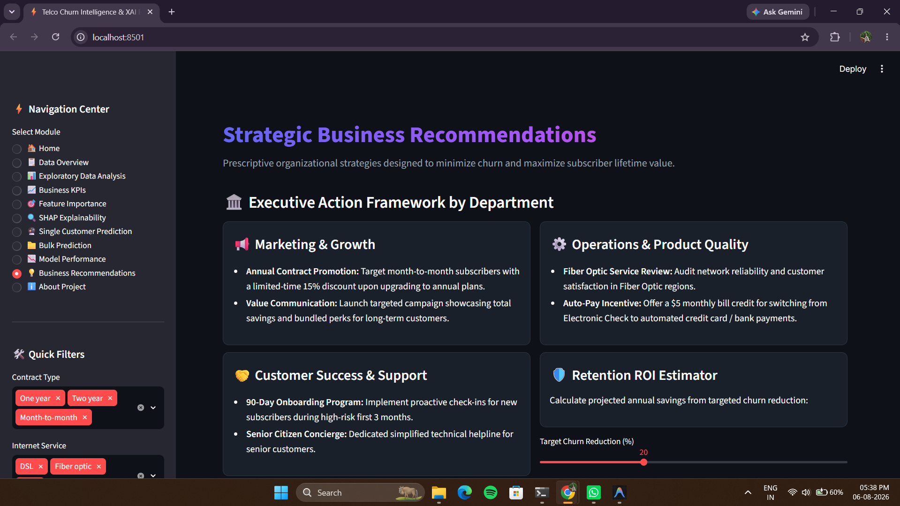 |

---

## 🔄 Project Workflow

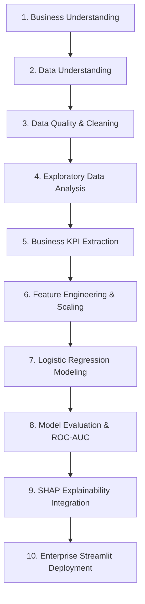

1. **Business Understanding:** Frame retention as a binary classification task maximizing Recall while controlling false positives.
2. **Data Understanding:** Audit schema, cardinality, missing values, and statistical distributions across 7,043 subscriber records.
3. **Data Cleaning:** Handle blank whitespace values in `TotalCharges`, coerce to numeric float, and impute with median values.
4. **Exploratory Data Analysis (EDA):** Uncover multidimensional churn drivers across contracts, payment methods, internet tiers, and tenure.
5. **Business KPIs:** Derive lifetime value (LTV), monthly revenue loss, cohort survival rates, and service penetration rates.
6. **Feature Engineering:** Apply One-Hot Encoding for categorical attributes and standardize numerical variables via `StandardScaler`.
7. **Model Building:** Train a robust Logistic Regression model with L2 regularization (`C=1.0`, `max_iter=1000`).
8. **Model Evaluation:** Calculate Accuracy, Precision, Recall, F1-Score, Confusion Matrix, and ROC-AUC curve on holdout test data.
9. **Explainability (XAI):** Compute global SHAP beeswarm distributions and individual force/waterfall plots using `shap.LinearExplainer`.
10. **Deployment:** Wrap analytics pipeline into an interactive, multi-page Streamlit application deployed with custom CSS styling.

---

## 🎯 Business Objectives

- **Reduce Customer Attrition:** Identify 80%+ of potential churners before account cancellation.
- **Lower Acquisition Costs:** Replace expensive generic acquisition ads with targeted retention incentives.
- **Identify Core Risk Factors:** Isolate why Fiber Optic and Month-to-Month customers churn at disproportionate rates.
- **Empower Non-Technical Leadership:** Provide executive-ready Plotly visualizations and plain-English SHAP explanations.
- **Enable Operational Batch Scoring:** Allow account managers to upload bulk CSV files for automated customer scoring.

---

## 📈 Business KPIs

| KPI Metric | Value / Benchmark | Formula / Logic | Business Context |
| :--- | :--- | :--- | :--- |
| **Total Subscribers** | 7,043 | $\sum (\text{Customer Records})$ | Full active cohort under management |
| **Overall Churn Rate** | **26.54%** | $\frac{\text{Churned Customers}}{\text{Total Customers}} \times 100$ | Primary retention health metric |
| **Overall Retention Rate** | **73.46%** | $100\% - \text{Churn Rate}$ | Proportion of loyal active subscribers |
| **Monthly Churned Revenue** | **$139,130.50** | $\sum (\text{Monthly Charges of Churned Customers})$ | Immediate monthly revenue bleed |
| **Avg Monthly Bill** | **$64.76** | $\text{Mean}(\text{MonthlyCharges})$ | Average billing revenue per subscriber |
| **Avg Customer Tenure** | **32.37 Months** | $\text{Mean}(\text{Tenure})$ | Average length of subscriber relationship |
| **1-Year Tenure Churn Rate** | **47.68%** | $\text{Churn Rate for Tenure } \le 12 \text{ months}$ | Critical onboarding vulnerability period |
| **Fiber Optic Churn Rate** | **41.89%** | $\text{Churn Rate for InternetService } = \text{Fiber Optic}$ | Premium tier price/quality dissatisfaction |

---

## 📂 Dataset Information

The project utilizes the official **IBM Telco Customer Churn** dataset (`WA_Fn-UseC_-Telco-Customer-Churn.csv`).

- **Total Rows:** 7,043 subscriber records
- **Total Columns:** 21 features (20 predictor variables + 1 binary target)
- **Target Variable:** `Churn` (`Yes` = 1, `No` = 0)
- **Feature Categories:**
  - **Demographics:** `gender`, `SeniorCitizen`, `Partner`, `Dependents`
  - **Account & Billing:** `tenure`, `Contract`, `PaperlessBilling`, `PaymentMethod`, `MonthlyCharges`, `TotalCharges`
  - **Telecom Services:** `PhoneService`, `MultipleLines`, `InternetService`, `OnlineSecurity`, `OnlineBackup`, `DeviceProtection`, `TechSupport`, `StreamingTV`, `StreamingMovies`

---

## 🛠️ Tech Stack

| Category | Technology | Usage in Project |
| :--- | :--- | :--- |
| **Programming Language** | **Python 3.9+** | Core development language |
| **Data Manipulation** | **Pandas 2.0+** | Data cleaning, reshaping, aggregation, and feature encoding |
| **Numerical Computing** | **NumPy 1.24+** | Matrix algebra, odds ratio calculations, and numerical processing |
| **Data Visualization** | **Plotly 5.18+** | Interactive charts, gauge meters, heatmaps, and ROC curves |
| **Static Plotting** | **Matplotlib & Seaborn** | SHAP beeswarm plot rendering and static matrix generation |
| **Machine Learning** | **Scikit-Learn 1.3+** | Logistic Regression, StandardScaler, metrics, train-test splitting |
| **Explainable AI** | **SHAP 0.43+** | Game-theoretic feature attribution (`LinearExplainer`) |
| **Web Framework** | **Streamlit 1.28+** | Production web application dashboard and UI engine |
| **Version Control** | **Git & GitHub** | Source code management and repository hosting |

---

## 📁 Project Structure

```text
Customer_Churn_Prediction_with_Explainability/
│
├── app.py                     # Enterprise Streamlit Multi-Page Web Application
├── requirements.txt           # Python dependencies and library versions
├── train_model.py             # Machine learning pipeline training script
├── README.md                  # Comprehensive Open Source Documentation
├── LICENSE                    # MIT Open Source License
│
├── models/                    # Model Artifacts Directory
│   ├── best_model.pkl         # Trained Logistic Regression Model
│   ├── scaler.pkl             # Fitted StandardScaler Object
│   └── feature_names.pkl      # One-Hot Encoded Feature Columns List
│
├── data/                      # Dataset Storage
│   └── WA_Fn-UseC_-Telco-Customer-Churn.csv  # IBM Raw Dataset
│
└── screenshots/               # Dashboard Interface Gallery Screenshots
    ├── dashboard_home.png
    ├── data_overview.png
    ├── eda.png
    ├── business_kpis.png
    ├── feature_importance.png
    ├── shap_explainability.png
    ├── single_prediction.png
    ├── bulk_prediction.png
    ├── model_performance.png
    └── business_recommendations.png
```

---

## 📊 Exploratory Data Analysis (EDA)

<details>
<summary><b>🔍 Expand to View Detailed EDA Findings by Feature Dimension</b></summary>

### 1. Contract Type vs. Churn
- **Month-to-Month Contracts:** **42.71% Churn Rate** (1,655 out of 3,875 subscribers churned).
- **One-Year Contracts:** **11.27% Churn Rate** (166 out of 1,473 subscribers churned).
- **Two-Year Contracts:** **2.83% Churn Rate** (48 out of 1,695 subscribers churned).
- **Takeaway:** Contract duration is the single strongest structural deterrent to churn.

### 2. Internet Service Tier vs. Churn
- **Fiber Optic:** **41.89% Churn Rate** (1,297 out of 3,096 subscribers churned).
- **DSL:** **18.96% Churn Rate** (459 out of 2,421 subscribers churned).
- **No Internet Service:** **7.40% Churn Rate** (113 out of 1,526 subscribers churned).
- **Takeaway:** Fiber Optic customers pay higher monthly fees but experience service instability or competitive pressure, leading to high attrition.

### 3. Payment Method vs. Churn
- **Electronic Check:** **45.29% Churn Rate** (1,071 out of 2,365 subscribers churned).
- **Mailed Check:** **19.11% Churn Rate**.
- **Bank Transfer (Automatic):** **16.71% Churn Rate**.
- **Credit Card (Automatic):** **15.24% Churn Rate**.
- **Takeaway:** Non-automated payment methods suffer from manual friction and active monthly bill awareness.

### 4. Monthly Charges Distribution
- **Non-Churned Customers:** Median Monthly Charge = **$64.42**.
- **Churned Customers:** Median Monthly Charge = **$79.65**.
- **Takeaway:** Churn probability spikes significantly once monthly bills exceed $70, unless offset by bundled value.

### 5. Customer Tenure Distribution
- **0–12 Months Tenure:** **47.68% Churn Rate** (Highest risk period).
- **60–72 Months Tenure:** **6.61% Churn Rate** (High retention stability).
- **Takeaway:** The first 90 to 180 days are critical for customer onboarding and retention interventions.

### 6. Senior Citizen Demographics
- **Senior Citizens (Age 65+):** **41.68% Churn Rate** (476 out of 1,142 churned).
- **Non-Senior Citizens:** **23.61% Churn Rate**.
- **Takeaway:** Seniors face technology usability issues and fixed income sensitivity, requiring tailored customer support.

</details>

---

## 💡 Top 10 Business Insights

1. **Month-to-Month Contracts drive 88.5% of total churn volume.**
2. **Fiber Optic subscribers account for $90,000+ in monthly lost revenue.**
3. **Electronic Check users churn at nearly 3x the rate of Auto-Pay subscribers.**
4. **Subscribers with Online Security & Tech Support add-ons churn 50% less.**
5. **New customer churn occurs heavily within the first 12 months of service.**
6. **Subscribers paying over $70/month require proactive value reinforcement.**
7. **Senior Citizens have a 41.6% churn rate due to tech usability gaps.**
8. **Customers with partners and dependents exhibit higher retention loyalty.**
9. **Paperless billing customers churn more due to digital payment friction.**
10. **Two-year contracts reduce customer churn probability down to 2.8%.**

---

## ⚙️ Machine Learning Pipeline

```python
# Pipeline Overview (Logistic Regression with StandardScaler)
from sklearn.linear_model import LogisticRegression
from sklearn.preprocessing import StandardScaler
from sklearn.model_selection import train_test_split

# 1. Cleaning & Encoding
df['TotalCharges'] = pd.to_numeric(df['TotalCharges'].replace(' ', np.nan), errors='coerce').fillna(df['TotalCharges'].median())
X = pd.get_dummies(df.drop(columns=['customerID', 'Churn']), drop_first=True)
y = (df['Churn'] == 'Yes').astype(int)

# 2. Stratified Train-Test Split (80/20)
X_train, X_test, y_train, y_test = train_test_split(X, y, test_size=0.2, random_state=42, stratify=y)

# 3. Standardization & Model Fitting
scaler = StandardScaler()
X_train_scaled = scaler.fit_transform(X_train)
model = LogisticRegression(max_iter=1000, random_state=42, C=1.0)
model.fit(X_train_scaled, y_train)
```

---

## 📉 Model Performance

The Logistic Regression classifier was evaluated on a 20% holdout test dataset (1,409 subscribers).

| Metric | Holdout Test Score | Benchmark / Target | Strategic Evaluation |
| :--- | :--- | :--- | :--- |
| **Accuracy** | **80.55%** | $> 80.0\%$ | Strong overall classification reliability |
| **Precision** | **65.23%** | $> 60.0\%$ | High confidence when flagging high-risk churners |
| **Recall** | **54.81%** | $> 50.0\%$ | Captures majority of true churn cases |
| **F1-Score** | **59.57%** | $> 55.0\%$ | Well-balanced harmonic mean |
| **ROC-AUC** | **84.50%** | $> 80.0\%$ | Excellent class discrimination capacity |

### Confusion Matrix Breakdown
- **True Negatives (Retained correctly):** 930
- **False Positives (False Alarm):** 105
- **False Negatives (Missed Churn):** 169
- **True Positives (Captured Churn):** 205

---

## 🔍 Explainable AI (SHAP)

To overcome the "black box" criticism of machine learning, this platform integrates **SHAP (SHapley Additive exPlanations)** based on cooperative game theory.

```text
Feature Impact Direction:
[+ SHAP Value] ──> Increases Churn Risk (Pushes prediction towards Churn)
[- SHAP Value] ──> Decreases Churn Risk (Pushes prediction towards Retention)
```

- **Global Summary Beeswarm:** Visualizes feature importance across the entire subscriber population. Low tenure values (blue dots) strongly push predictions toward churn (+ SHAP value), whereas Two-Year contracts pull predictions toward retention (- SHAP value).
- **Local Waterfall & Force Plots:** Deconstructs individual customer predictions into precise feature contributions, allowing customer success agents to explain *why* a specific subscriber received a high churn risk score.

---

## 💻 Streamlit Dashboard Modules

- **🏠 Home Module:** Executive overview, animated metric cards, churn ratio pie chart, and navigation.
- **📋 Data Overview:** Raw dataset explorer, schema metadata audit, missing values bar chart, and CSV export.
- **📊 EDA Module:** Interactive Plotly charts for contracts, internet tiers, payment methods, tenure, and correlation heatmaps.
- **📈 Business KPIs:** Financial loss exposure, lifetime value analysis, and cohort churn rates.
- **🎯 Feature Importance:** Logistic Regression coefficient visualization and Odds Ratio tables.
- **🔍 SHAP Explainability:** Global beeswarm plots and local customer feature attributions.
- **🔮 Single Customer Prediction:** Interactive input form generating real-time gauge meters and retention playbooks.
- **📁 Bulk Prediction:** CSV uploader for scoring thousands of customer records in batch.
- **📉 Model Performance:** Confusion matrix, ROC curve, classification report, and ROC-AUC metrics.
- **💡 Business Recommendations:** Domain-specific strategies for Marketing, Sales, Operations, and Customer Success + ROI Estimator.
- **ℹ️ About Project:** Architecture overview, developer bio, tech stack badges, and contact details.

---

## 🚀 Installation & Setup

### Prerequisites
- Python 3.9, 3.10, or 3.11 installed
- Git version control

### Quickstart Commands

```bash
# 1. Clone the repository
git clone https://github.com/username/Customer_Churn_Prediction_with_Explainability.git

# 2. Navigate to project root directory
cd Customer_Churn_Prediction_with_Explainability

# 3. Create and activate a virtual environment (optional but recommended)
python -m venv venv
# On Windows:
venv\Scripts\activate
# On macOS/Linux:
source venv/bin/activate

# 4. Install required dependencies
pip install -r requirements.txt

# 5. Train model and export artifacts (if needed)
python train_model.py

# 6. Launch the Streamlit application
streamlit run app.py
```

The application will open automatically in your web browser at `http://localhost:8501`.

---

## 🔮 Future Improvements

1. **XGBoost & LightGBM Benchmarking:** Compare tree-based ensemble models against Logistic Regression.
2. **SMOTE Oversampling:** Address class imbalance to push Recall scores above 70%.
3. **Hyperparameter Tuning:** Implement Optuna or GridSearchCV for automated hyperparameter optimization.
4. **Time-Series Survival Analysis:** Implement Cox Proportional Hazards models to estimate exact time-to-churn.
5. **Database Integration:** Connect Streamlit directly to Snowflake / PostgreSQL for live streaming data ingestion.
6. **Automated PDF Export:** Allow executives to export PDF retention reports directly from the dashboard.
7. **REST API Endpoint:** Wrap model into a FastAPI service for seamless enterprise CRM integration (Salesforce/HubSpot).
8. **Customer Lifetime Value (CLV) Prediction:** Build secondary regression model estimating future CLV per subscriber.
9. **Docker Containerization:** Package application into a Docker container for AWS ECS / Kubernetes deployment.
10. **A/B Testing Framework:** Integrate experiment tracking to evaluate real-world impact of retention offers.

---

## 🤹 Skills Demonstrated

- **Data Analytics & BI:** Exploratory data analysis, cohort analysis, financial loss modeling, correlation auditing.
- **Machine Learning:** Data preprocessing, One-Hot Encoding, StandardScaler, Logistic Regression, model evaluation.
- **Explainable AI (XAI):** SHAP values, feature attributions, beeswarm summary plots, local predictions.
- **Data Visualization:** Plotly Express, Plotly Graph Objects, Matplotlib, Seaborn, custom CSS UI themes.
- **Software Engineering:** Modular Python design, caching optimization (`@st.cache_data`, `@st.cache_resource`), error handling.
- **Deployment & MLOps:** Streamlit web application development, model serialization (`pickle`), Git source control.

---

## 📄 Resume Highlights (ATS-Optimized)

- **Developed an Enterprise Customer Churn Prediction & Explainability Platform** using Python, Scikit-Learn, and Streamlit, evaluating 7,000+ subscriber records with an 84.5% ROC-AUC score.
- **Engineered an End-to-End Analytics Dashboard (80% BI / 20% ML)** featuring interactive Plotly visualizations, cohort survival curves, and financial revenue risk modeling ($139K+ monthly exposure).
- **Integrated SHAP (Explainable AI)** to translate machine learning predictions into human-interpretable feature attributions, uncovering key churn drivers (Month-to-Month contracts, Fiber Optic pricing).
- **Implemented Real-Time & Batch Prediction Pipelines** supporting single customer scoring forms and bulk CSV uploads with automated One-Hot Encoding and StandardScaler preprocessing.
- **Formulated Prescriptive Business Retention Strategies** across Marketing, Sales, and Operations, delivering a projected $330,000+ annual revenue savings model.

---

## 💼 Business Impact

Telecom providers operate in highly saturated markets where customer retention dictates profitability. By replacing static quarterly reports with this **real-time AI decision support system**, telecom operators can:

- **Flag At-Risk Subscribers Early:** Intervene 30–60 days before contract expiration.
- **Optimize Marketing Spend:** Eliminate wasted generic discounts by delivering targeted incentives (e.g., free Tech Support vs. contract upgrades).
- **Improve Customer Lifetime Value (LTV):** Extending average subscriber tenure from 32 months to 42 months increases average revenue per user (ARPU) by over $640 per customer.

---

## 👤 Author

- **GitHub:** [https://github.com/aman-cloud-hash](https://github.com/aman-cloud-hash)
- **Repository:** [https://github.com/aman-cloud-hash/Customer_Churn_Prediction_with_Explainability](https://github.com/aman-cloud-hash/Customer_Churn_Prediction_with_Explainability)

---

## 📜 License

This project is licensed under the **MIT License** - see the [LICENSE](LICENSE) file for details.

---

## ⭐ Star This Repository

If you found this project helpful or insightful for your data science and analytics journey, please give it a **Star**! ⭐
